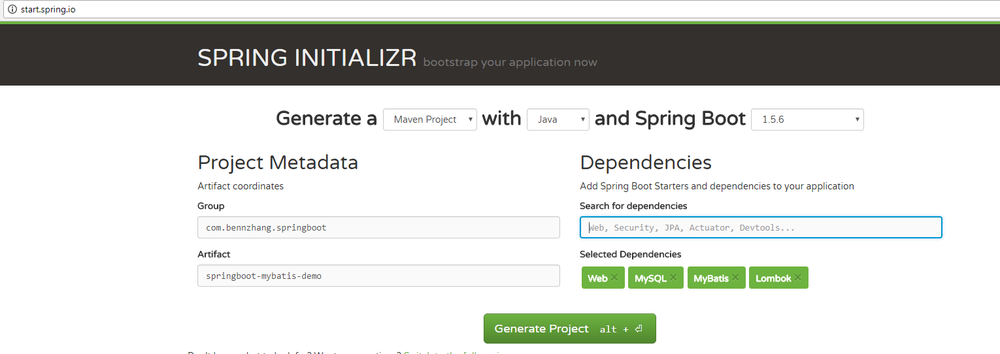
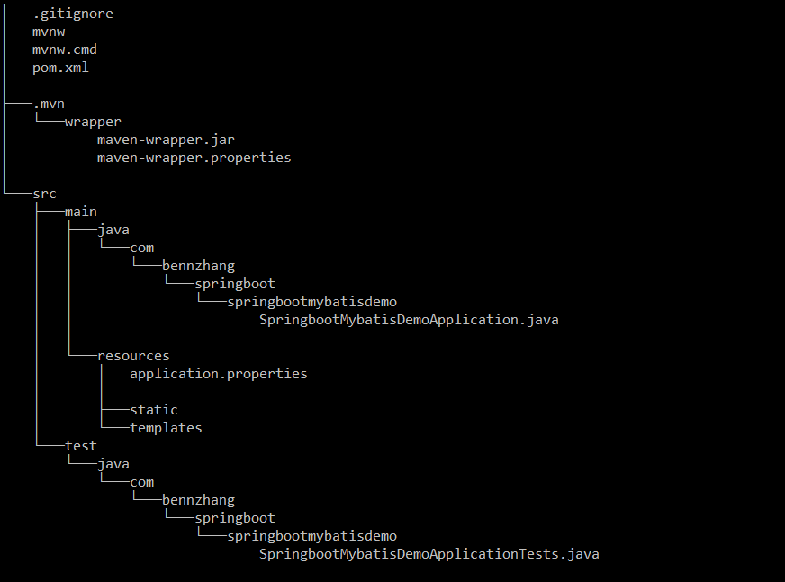

# springboot-mybatis-demo
Go to [http://start.spring.io/](http://start.spring.io/), create your project template like below



Download `Generate Project` and get project structure like this. 


## Edit application.properties
Add settings in the `application.properties` file

```
server.port=9090

# Datasources

# default, if not defined use this one
spring.datasource.url=jdbc:mysql://localhost:3306/test
spring.datasource.username=test
spring.datasource.password=test
spring.datasource.driver-class-name=com.mysql.jdbc.Driver
spring.datasource.testWhileIdle=true
spring.datasource.validationQuery=SELECT 1
```

## Add Mapper/Domain/Service

## Compile/Run Springboot service
```
mvn clean install -Dmaven.skip.test=true
java -jar target/springboot-mybatis-demo-0.0.1-SNAPSHOT.jar
```

### Import Test Data

```
springboot-mybatis-demo\src\main\resources\mysql.sql
```


## Test your webservice
http://localhost:9090/rest/grades

```
[{"studentName":"Simon","subjectName":"History","grade":"A"},{"studentName":"Elenor","subjectName":"History","grade":"B+"},{"studentName":"Simon","subjectName":"Biology","grade":"B"},{"studentName":"Stu","subjectName":"Biology","grade":"F"},{"studentName":"Alvin","subjectName":"SF","grade":"C"},{"studentName":"Theo","subjectName":"SF","grade":"B"},{"studentName":"Stu","subjectName":"SF","grade":"C+"}]
```
